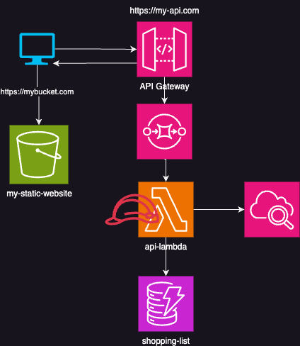

# Mein erstes API

## Allgemeine Infrastruktur

## API Dokumentation
`GET /allitems`: Gibt Alle Elemente der Shopping Liste zurück

`GET /itembyid/{itemdId}`: Gibt ein einzelnes Element zurück.
**Parameter**: `itemId` - Einzigartige Id des Elements

`PUT /newitem/{newitem}`: Erstellt eine neues Element. 
**Parameter**: `newitem` - Einzigartige Id des Elements.

`DELETE /deleteitem/{deleteitem}`: Löscht ein Element.
**Parameter**: `deleteitem` - Einzigartige Id des entfernen.

`Update /updateitems/{updateitems}`: Aktualisiert die Elemente
**Parameter**: `updateitems` - Aktualisieren aller Elemente.
